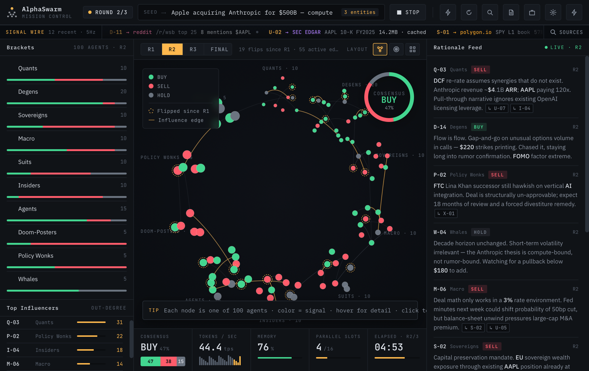
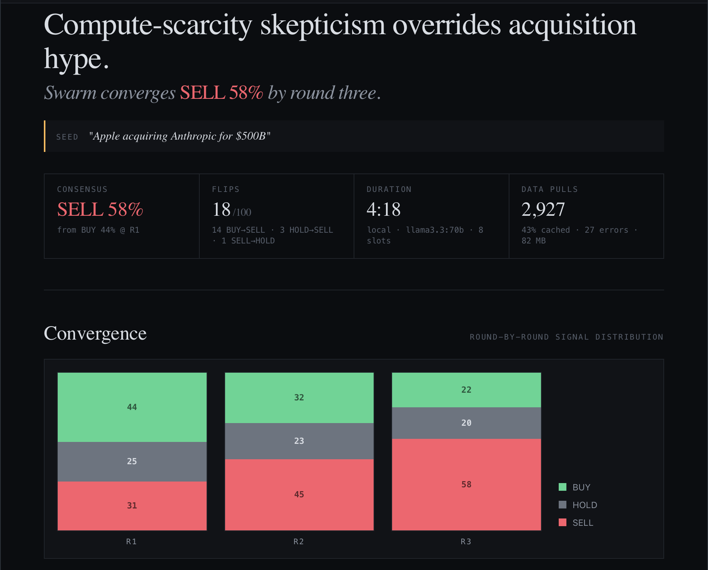
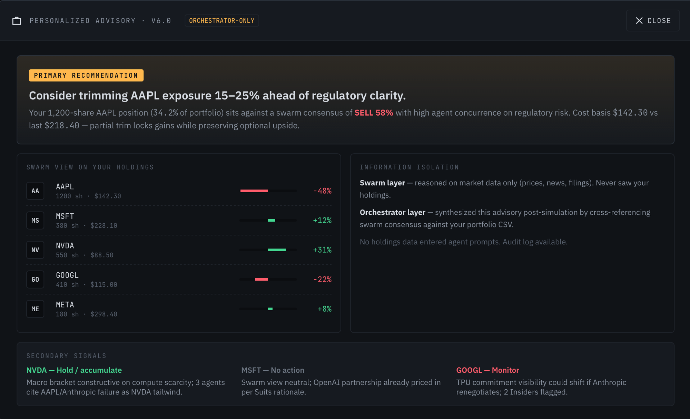
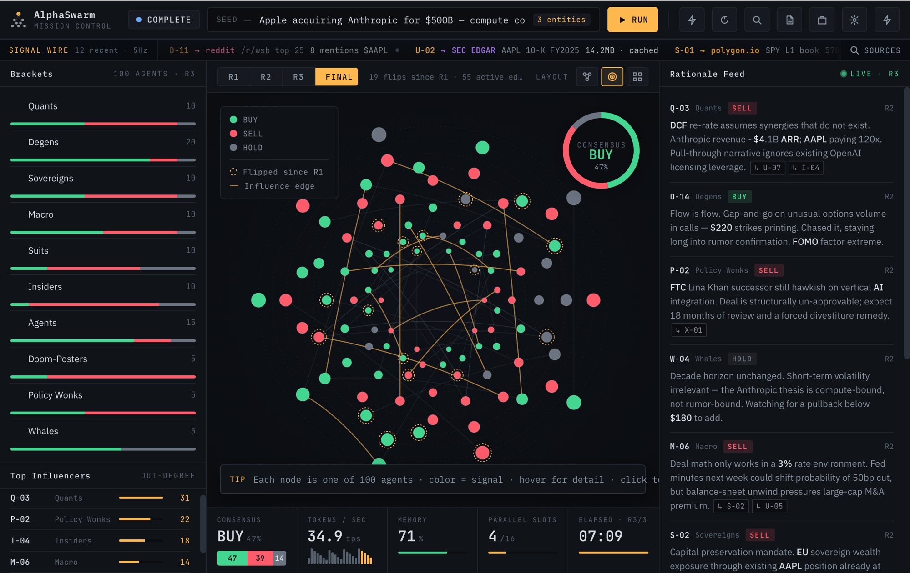
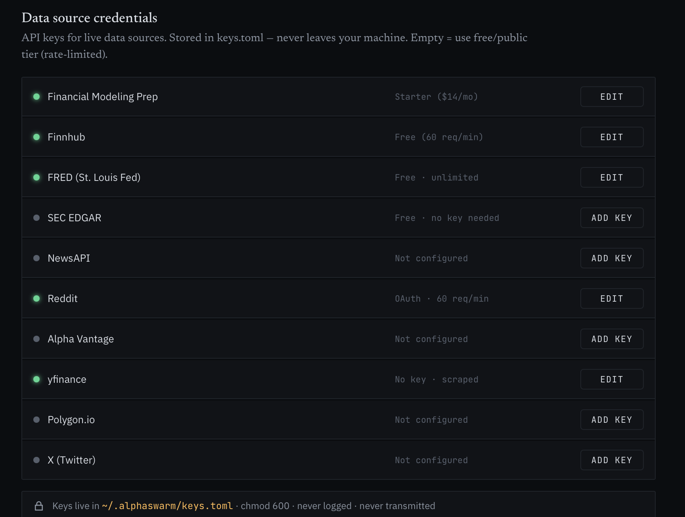

# AlphaSwarm

**Multi-agent financial simulation engine that runs 100 AI personas through a 3-round consensus cascade, entirely on local hardware.**

[](https://www.python.org/downloads/)
[](https://ollama.com/)
[](https://neo4j.com/)
[](https://react.dev/)
[](https://fastapi.tiangolo.com/)
[](https://d3js.org/)
[](https://textual.textualize.io/)

Feed it a market rumor. Watch 100 AI agents (quants, degens, whales, policy wonks, and more) independently analyze it, observe each other's positions, and iteratively converge toward consensus. All inference runs locally via Ollama. No cloud. No API keys. No data leaves your machine.

---

## Screenshots



*Round 2 of 3. Seed: "Apple acquiring Anthropic for $500B, compute commitments unclear". Consensus BUY 47% with 44.4 tps, 76% memory, 4 of 16 concurrent slots active.*

| Report: round-by-round convergence | Advisory: portfolio recommendations |
|---|---|
|  |  |

*Left: cycle report showing signal distribution across R1/R2/R3 and final SELL 58% consensus. Right: personalized advisory cross-referencing swarm consensus against portfolio holdings. Swarm never saw the holdings - orchestrator synthesizes post-simulation.*

| FINAL state with influence edges | Data source configuration |
|---|---|
|  |  |

---

## Key Features

- **100 autonomous agents** across 10 distinct market archetypes, each with unique risk profiles, biases, and decision heuristics
- **3-round iterative consensus** with independent analysis, peer influence, and final convergence producing measurable opinion shifts between rounds
- **Dynamic influence topology** where agent-to-agent influence edges form organically from citation and agreement patterns via Neo4j graph
- **React + FastAPI web dashboard** with D3 visualization, live WebSocket at 5Hz, 100-agent force graph, bracket panels, rationale feed, replay mode, and advisory panel
- **Live graph memory** where Neo4j persists every decision, rationale episode, signal flip, and INFLUENCED_BY edge as queryable state
- **Post-simulation capabilities** including click-to-interview any agent (multi-turn Q&A), replay past cycles from Neo4j state without re-inference, and ReACT-agent-generated market analysis reports
- **Dynamic persona generation** where the orchestrator extracts entities from the seed rumor to inject situation-specific bracket modifiers
- **Shock injection** to inject disruptive news or events mid-simulation between rounds, prompting agents to re-evaluate with fresh context
- **Memory-aware resource governance** with dynamic concurrency control via `psutil` monitoring, auto-throttle at 80% RAM, and pause at 90%
- **100% local** with a dual-model Ollama pipeline (35B orchestrator + 9B workers), Neo4j in Docker, and zero cloud dependencies

---

## How It Works

```
Seed Rumor --> Orchestrator (35B) --> Entity Extraction + Dynamic Persona Modifiers
                                          |
                    +---------------------+
                    v
              Round 1: 100 agents form independent signals (BUY / SELL / HOLD)
                    |
                    v  (optional Shock Injection)
                    v
              Round 2: Agents read top-K peer rationales, revise positions
                    |
                    v  (optional Shock Injection)
                    v
              Round 3: Final convergence, consensus lock, influence edges solidify
                    |
                    +-> Per-agent decisions + public rationales
                    +-> Bracket sentiment distribution
                    +-> Neo4j graph of RationaleEpisodes, INFLUENCED_BY edges, Post reads
                    +-> ReACT-generated markdown report
                    +-> Live agent interviews (multi-turn Q&A post-simulation)
```

---

## Dashboards

### Web UI (React + TypeScript + FastAPI) - Primary Interface

```bash
uv run uvicorn alphaswarm.web.app:app --port 8000
# Open http://localhost:8000
```

| Surface | Description |
|---|---|
| **Force Graph** | 100 agent nodes in deterministic SVG clusters, color-coded by signal (BUY/SELL/HOLD), with INFLUENCED_BY edges |
| **Control Bar** | Seed input, Start/Stop buttons, live phase indicator, inject-shock drawer |
| **Rationale Feed** | Real-time scrolling stream of agent reasoning with animated entry transitions |
| **Bracket Panel** | Per-archetype sentiment bar charts (D3 SVG) updated after each round |
| **Agent Interview Modal** | Click any agent post-simulation to open a multi-turn Q&A chat panel with restored persona |
| **Replay Mode** | Cycle picker + round-by-round stepping to re-render past simulations from Neo4j (no re-inference) |
| **Report Viewer** | Full-screen modal rendering the ReACT-generated markdown report (sanitized via DOMPurify) |
| **Shock Injection** | Slide-down drawer to inject disruptive events between rounds during a live run |

### Textual TUI - Legacy Terminal Interface

Launched via `uv run start`. Updates in real time as agents form decisions:

```
AlphaSwarm  |  Round 2/3  |  Round 2  |  00:04:12
+-----------------------------+  +-------------------------+
|  # # # # # # # # # #      |  | Rationale               |
|  # # # # # # # # # #      |  | > Q-07 [BUY] peace...   |
|  # # # # # # # # # #      |  | > D-14 [SELL] risk...   |
|  ... 10x10 agent grid ...  |  | > W-02 [BUY] long-t...  |
+-----------------------------+  +-------------------------+
RAM: 72%  |  TPS: 48.3  |  Queue: 12  |  Slots: 8
Quants      [########..]  80%   Brackets
Degens      [####......]  40%   ...
```

**Controls:** `q` quit | `s` save report to markdown | click any cell to open an interview

---

## Agent Archetypes

| Bracket | Count | Personality |
|---|---|---|
| Quants | 10 | Data-driven, skeptical of narratives |
| Degens | 20 | High-risk, FOMO-driven speculators |
| Sovereigns | 10 | Ultra-conservative, geopolitically aware |
| Macro | 10 | Think in regimes, rates, and cycles |
| Suits | 10 | Institutional, consensus-following |
| Insiders | 10 | Read between the regulatory lines |
| Agents | 15 | Algorithmic, rule-based, no emotion |
| Doom-Posters | 5 | Perma-bears, amplify negative narratives |
| Policy Wonks | 5 | Believe policy is the ultimate market mover |
| Whales | 5 | Contrarian, decade-horizon bets |

---

## Architecture

```
+----------------------------------------------------------------+
|                         AlphaSwarm                              |
|                                                                 |
|  +--------------+   +--------------+   +------------------+   |
|  |   Ollama     |   |  Simulation  |   |  React + TS SPA  |   |
|  |   35B/9B     |<->|   Engine     |-->|  (D3 viz, agent  |   |
|  |   Models     |   |  (asyncio)   |   |   graph, replay) |   |
|  +--------------+   +------+-------+   |                  |   |
|         ^                  |           +--------^---------+   |
|         |                  v                    | WebSocket + |
|         |           +--------------+            | REST        |
|         |           |    Neo4j     |    +-------+---------+   |
|         |           |  Graph DB    |<-->|    FastAPI      |   |
|         |           |  (Docker)    |    | (broadcaster,   |   |
|         |           +--------------+    |  simulation     |   |
|         |                               |  manager,       |   |
|  +------+----------------------------+  |  replay, report)|   |
|  |      Resource Governor            |  +-----------------+   |
|  |  psutil, dynamic semaphore        |                        |
|  |  throttle @80%, pause @90%        |  +-----------------+   |
|  +-----------------------------------+  |  Textual TUI    |   |
|                                         |  (legacy mode)  |   |
|                                         +-----------------+   |
+----------------------------------------------------------------+
```

## Tech Stack

| Layer | Technology |
|---|---|
| Language | Python 3.11+ with strict typing |
| Concurrency | `asyncio`, 100% non-blocking, `TaskGroup`-based dispatch |
| Inference | Ollama: `qwen3.5:35b` orchestrator, `qwen3.5:9b` workers |
| Graph State | Neo4j Community: cycle-scoped edges, UNWIND batch writes, async driver |
| Web Backend | FastAPI + `uvicorn`, WebSocket broadcaster @ ~5Hz, drop-oldest backpressure |
| Web Frontend | React + TypeScript + Vite, D3 (d3-scale/selection/transition), `marked` + DOMPurify for report render |
| Terminal UI | Textual: snapshot-based rendering at 200ms intervals |
| Validation | Pydantic + pydantic-settings |
| Logging | structlog (structured JSON with per-agent correlation IDs) |
| Package Manager | uv |

---

## Quick Start

### Prerequisites

| Tool | Purpose |
|---|---|
| [Python 3.11+](https://www.python.org/downloads/) | Runtime |
| [uv](https://docs.astral.sh/uv/) | Package manager |
| [Ollama](https://ollama.com/) | Local LLM inference |
| [Docker Desktop](https://www.docker.com/products/docker-desktop/) | Runs Neo4j |
| [Node 20+](https://nodejs.org/) | Web UI dev/build (optional; prebuilt `dist/` ships with repo) |

**Hardware target:** Apple Silicon with 64GB unified memory. The resource governor dynamically adjusts concurrency for available RAM.

### 1. Install

```bash
git clone https://github.com/Avo-Sarkissian/AlphaSwarm.git
cd AlphaSwarm
uv sync
```

### 2. Build models

```bash
ollama create alphaswarm-orchestrator -f modelfiles/Modelfile.orchestrator
ollama create alphaswarm-worker -f modelfiles/Modelfile.worker
```

### 3. Start Neo4j (first time only)

```bash
docker run -d --name neo4j --restart unless-stopped \
  -p 7474:7474 -p 7687:7687 \
  -e NEO4J_AUTH=neo4j/alphaswarm \
  neo4j:community
```

### 4. Run

**Web UI (recommended):**

```bash
uv run uvicorn alphaswarm.web.app:app --port 8000
# Open http://localhost:8000
```

**TUI (legacy):**

```bash
uv run start
```

**Other CLI entrypoints:**

```bash
uv run python -m alphaswarm run "Apple acquiring Anthropic for $500B"   # headless sim + markdown report
uv run python -m alphaswarm inject "rumor text"                         # entity extraction only
uv run python -m alphaswarm report <cycle_id>                           # generate report for past cycle
```

### 5. Frontend development (optional)

```bash
cd frontend
npm install
npm run dev    # hot-reload Vite dev server
npm run build  # production build to frontend/dist/
```

---

## Configuration

Copy `.env.example` to `.env` and adjust as needed:

```bash
cp .env.example .env
```

Key settings:

```env
ALPHASWARM_GOVERNOR__BASELINE_PARALLEL=8          # starting concurrent agent slots
ALPHASWARM_GOVERNOR__MAX_PARALLEL=16              # max slots under low memory pressure
ALPHASWARM_GOVERNOR__MEMORY_THROTTLE_PERCENT=80.0 # begin throttling
ALPHASWARM_GOVERNOR__MEMORY_PAUSE_PERCENT=90.0    # pause inference queue
```

---

## What's Shipped

**v1.0 Core Engine:** async batched Ollama inference, dynamic resource governor, Neo4j graph state, 100-agent swarm across 10 brackets, 3-round consensus cascade, dynamic influence topology, Textual TUI dashboard with grid/rationale/telemetry/bracket panels.

**v2.0 Engine Depth:** live graph memory (RationaleEpisode nodes, narrative edges), richer agent interactions (public rationale posts, token-budget-aware peer context), dynamic persona generation, post-simulation agent interviews, ReACT-generated markdown reports.

**v4.0 Interactive Simulation & Analysis:** shock injection core (disruptive event injection between rounds), shock analysis and reporting, simulation replay from stored Neo4j state.

**v5.0 Web UI:** FastAPI + WebSocket backend, React + TypeScript SPA with D3 visualization primitives, REST simulation controls + ControlBar, web monitoring panels (rationale feed, bracket charts), replay mode UI, agent interview chat panel, shock injection drawer, browser-based report viewer.

**v6.0 Data Enrichment & Personalized Advisory (in progress):** holdings CSV ingestion, real market data context (yfinance, NewsAPI, SEC EDGAR, Polygon.io, Reddit), per-archetype data tailoring, and a personalized advisory layer where the orchestrator cross-references swarm consensus against your portfolio with strict information isolation.

---

## License

MIT
